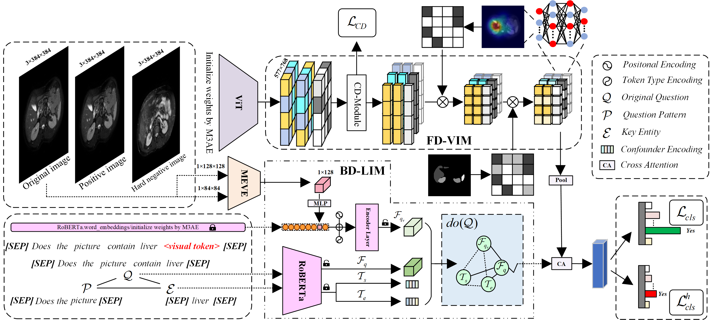

<p align="center">
  
</p>


<p align="center">
  <a href="https://github.com/cloneiq/CIMB-MVQA/stargazers">
    
  </a>
  <a href="https://github.com/cloneiq/CIMB-MVQA/commits/main">
    
  </a>
  <a href="https://github.com/cloneiq/CIMB-MVQA">
    
  </a>
  <a href="https://opensource.org/license/MIT">
    
  </a>
  <a href="https://doi.org/10.1016/j.media.2025.103850">
    
  </a>
</p>

<p align="center">
  <b>Official implementation of CIMB-MVQA</b><br>
  Causal Intervention · Modality-specific Bias Mitigation · Medical Visual Question Answering
</p>

## Overview

**CIMB-MVQA** is the official implementation of:

> **CIMB-MVQA: Causal Intervention on Modality-specific Biases for Medical Visual Question Answering**

Medical Visual Question Answering (Med-VQA) aims to combine medical image understanding with clinical language reasoning, enabling automatic answering of natural language questions grounded on medical images. Recent progress in deep learning has achieved impressive results on Med-VQA benchmarks; however, existing models still suffer from spurious correlations caused by data bias and structural confounders in both the visual and language modalities. These biases compromise the model’s robustness and generalization in realistic clinical environments.

CIMB-MVQA addresses cross-modal bias by explicitly modeling and adjusting for confounding factors. The method combines **causal intervention**, **contrastive representation learning**, **feature disentanglement**, **dual semantic masking**, and a **vision-guided pseudo-token injection mechanism** to achieve higher answer accuracy, better causal interpretability, and stronger robustness against distribution shifts.The overall architecture of the proposed method is depicted in the figure below.

<p align="center">
  
</p>

<p align="center">
  <sub>Overall architecture of CIMB-MVQA.</sub>
</p>

This paper was published in **Medical Image Analysis**, Volume 107, Part B, 2026, Article 103850. The source code is publicly available at: <a href="https://github.com/cloneiq/CIMB-MVQA">
    <b>https://github.com/cloneiq/CIMB-MVQA</b>
  </a>

## Key Features

- Causal intervention framework to systematically debias both visual and linguistic confounders.
- Front-door adjustment mechanism to mitigate non-observable visual biases.
- Back-door intervention strategy for suppressing observed language confounding signals.
- Robustness and generalization validated across both standard and intentionally biased Med-VQA datasets.
- Modular and extensible PyTorch implementation with reproducible training pipelines.

## Quick Start

### Clone the Repository

```bash
git clone https://github.com/cloneiq/CIMB-MVQA.git
cd CIMB-MVQA
```

### Install Requirements

```bash
pip install -r requirements.txt
```

### Prepare Datasets and Pretrained Weights

Prepare the datasets, pretrained weights, and `roberta-base` files according to the instructions in [Data Preparation](#data-preparation).

### Train and Test

Run training and testing scripts as described in [Train & Test](#train--test).

## Project Structure

```bash
CIMB-MVQA/
├── checkpoints/
├── data/
│   ├── rad/
│   │   ├── confounderembedding/
│   │   ├── imgs/
│   │   ├── train.json
│   │   ├── valid.json
│   │   └── test.json
│   ├── slake/
│   │   └── ...
│   └── vqamed2019/
│       └── ...
├── pretrained_weights/
│   ├── m3ae.ckpt
│   ├── pretrained_ae.pth
│   └── pretrained_maml.weights
├── roberta-base/
├── main.py
├── train/
└── test.py
```

## Data Preparation

### Datasets

Please download the following datasets and place the files under the `data/` directory.

| Dataset | Description | Download |
|---|---|---|
| SLAKE | An English-Chinese bilingual Med-VQA benchmark containing 642 radiology images, including CT, MRI, and X-ray images, and 14,028 question-answer pairs, plus pixel-level masks and a medical knowledge graph. | [SLAKE](https://www.med-vqa.com/slake/) |
| VQA-RAD | A clinician-curated dataset built from MedPix, providing 315 radiology images and 3,515 question-answer pairs for visual question answering. | [VQA-RAD](https://osf.io/89kps/) |
| MedVQA 2019 | The ImageCLEF 2019 challenge corpus with 3,200 training images, 12,792 QA pairs, 500 validation images, 2,000 QA pairs, and 500 test images with 500 questions, covering modality, plane, organ, and abnormality queries. | [MedVQA 2019](https://zenodo.org/record/10499039) |

### Pretrained Weights

Download the **M3AE pretrained weight** and put it in the `/pretrained_weights` directory:

- [M3AE pretrained weight](https://drive.google.com/drive/folders/1b3_kiSHH8khOQaa7pPiX_ZQnUIBxeWWn)

Please also follow the **MEVE pretrained weights** and put them in the `/pretrained_weights` directory:

- [MEVE pretrained weights](https://github.com/aioz-ai/MICCAI19-MedVQA)

### roberta-base

Download `roberta-base` and put it in the `/roberta-base` directory:

- [roberta-base](https://drive.google.com/drive/folders/1ouRx5ZAi98LuS6QyT3hHim9Uh7R1YY1H)

## Train & Test

```bash
# Train
python main.py
# Test
python test.py
```

## Results

### Results on VQA-RAD and SLAKE

| Method | Reference | VQA-RAD Open | VQA-RAD Closed | VQA-RAD Overall | SLAKE Open | SLAKE Closed | SLAKE Overall |
|:---:|:---:|:---:|:---:|:---:|:---:|:---:|:---:|
| MEVE-BAN* | MICCAI’19 | 40.33 | 73.90 | 59.20 | 75.19 | 81.49 | 77.66 |
| MEVE-SAN* | MICCAI’19 | 39.57 | 72.92 | 58.09 | 74.57 | 77.88 | 75.87 |
| MHKD-MVQA | BIBM’22 | 63.10 | 80.50 | 73.60 | - | - | - |
| M3AE* | MICCAI’22 | 63.10 | 83.31 | 75.40 | 79.83 | 86.30 | 82.37 |
| PubMedCLIP | EACL’23 | 60.10 | 80.00 | 72.10 | 78.40 | 82.50 | 80.10 |
| CPCR | TMI’23 | 60.50 | 80.40 | 72.50 | 80.50 | 84.10 | 81.90 |
| LaPA* | CVPR’24 | 66.48 | 85.29 | 77.82 | 79.84 | 86.53 | 82.46 |
| CCIS-MVQA | TMI’24 | 68.78 | 79.24 | 75.06 | 80.12 | 86.72 | 84.08 |
| VG-CALF | Neurocomputing’25 | 67.00 | 85.50 | 76.10 | 81.40 | 83.80 | 83.30 |
| UnICLAM | MedIA’25 | 59.80 | 82.60 | 73.20 | 81.10 | 85.70 | 83.10 |
| **CIMB-MVQA** | **Ours** | **69.33±0.16** | **86.19±0.23** | **79.42±0.21** | **82.08±0.08** | **89.42±0.13** | **85.09±0.18** |

### Results on VQA-Med-2019

| Method | Reference | Modality | Plane | Organ | Abnormality | All |
|:---:|:---:|:---:|:---:|:---:|:---:|:---:|
| QC-MLB | TMI’20 | 82.45 | 73.17 | 70.94 | 4.85 | 57.85 |
| BPI-MVQA | TMI’22 | 84.83 | 84.80 | 72.81 | 19.20 | 65.41 |
| M3AE* | MICCAI’22 | 89.23 | 85.09 | **88.42** | 30.56 | 78.26 |
| CCIS-MVQA | TMI’24 | 88.78 | 88.16 | 84.18 | 12.35 | 68.37 |
| **CIMB-MVQA** | **Ours** | **92.74±0.11** | **88.76±0.13** | 86.40±0.36 | **36.21±0.27** | **80.27±0.32** |

## Future Work

- Extension to multi-lingual datasets and multi-task scenarios.
- Integration with medical knowledge.
- Support for additional clinical datasets.
- Benchmark with future SOTA methods.

## Acknowledgement

Our project references the code in the following repository. Thanks for their work and sharing.

- [M3AE](https://github.com/zhjohnchan/M3AE)

## Citation

If you find this work useful, please cite:

```bibtex
@article{liu2026cimbmvqa,
  title     = {CIMB-MVQA: Causal intervention on modality-specific biases for medical visual question answering},
  author    = {Liu, Bing and Liu, Lijun and Ding, Jiaman and Yang, Xiaobing and Peng, Wei and Liu, Li},
  journal   = {Medical Image Analysis},
  year      = {2026},
  month     = {Jan},
  volume    = {107},
  number    = {Pt B},
  pages     = {103850},
  issn      = {1361-8415},
  doi       = {10.1016/j.media.2025.103850},
  url       = {https://www.sciencedirect.com/science/article/pii/S1361841525003962},
  publisher = {Elsevier},
  keywords  = {Medical visual question answering; Causal inference; Causal intervention; Multimodal bias mitigation},
  note      = {Epub 2025 Oct 24}
}
```

## Contributing

We welcome pull requests and issues.

You can contribute by:

- Reporting bugs or reproduction issues.
- Improving documentation and usage instructions.
- Adding support for additional Med-VQA datasets.
- Extending the framework to new bias mitigation or causal intervention settings.
- Benchmarking CIMB-MVQA with future SOTA methods.

## License

This project is licensed under the **MIT License**. See the [LICENSE](https://opensource.org/license/MIT) file for details.

## Contact

Bing Liu, Kunming University of Science and Technology Kunming, Yunnan CHINA, email: 2717382435@qq.com

Lijun Liu, Associate Professor (Ph.D.), Kunming University of Science and Technology Kunming, Yunnan CHINA, email: cloneiq@kust.edu.cn

<p align="center">
  <sub>Maintained for reproducible, interpretable, and robust Medical Visual Question Answering research.</sub>
</p>
