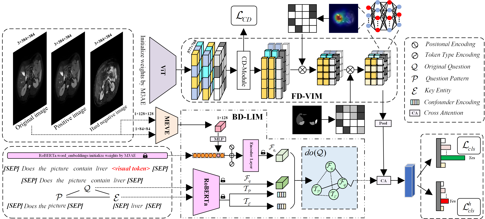

# CIMB-MVQA: Causal Intervention on Modality-specific Biases for Medical Visual Question Answering


<div  align="center">    

</div>


## Requirements
```bash
pip install -r requirements.txt 
```

## Preparation
```bash
├── checkpoints
├── data
│   ├── rad
│   │   ├──confounderembedding
│   │   ├──imgs
│   │   ├──train.json
│   │   ├──valid.json
│   │   ├──test.json
│   ├── slake
│   │   ├──....
│   ├── vqamed2019
│   │   ├──....
├── pretrained_weights
│   ├── m3ae.ckpt
│   ├── pretrained_ae.pth
│   ├── pretrained_maml.weights
├── roberta-base
├── main
├── tain
├── test
```
### Dataset
Please follow [here](https://github.com/zhjohnchan/M3AE?tab=readme-ov-file#1-dataset-preparation-1) and only use the `SLAKE, VQA RAD, and MedVQA 2019 datasets`.

### Pretrained
Download the [m3ae pretrained weight](https://drive.google.com/drive/folders/1b3_kiSHH8khOQaa7pPiX_ZQnUIBxeWWn) and put it in the `/pretrained_weights`.

Please follow the [MEVE pretrained weights](https://github.com/aioz-ai/MICCAI19-MedVQA) and put them in the `/pretrained_weights`.

### roberta-base
Download the [roberta-base](https://drive.google.com/drive/folders/1ouRx5ZAi98LuS6QyT3hHim9Uh7R1YY1H) and put it in the `/roberta-base`.


## Train & Test

```bash
# cd this file 
python main.py
# cd this file
python test.py
```

## Result
| Method     | Reference |           | VQA-RAD    |             |           | SLAKE      |             |
|:-------------------:|:----------:|:-----:|:------:|:-------:|:-----:|:------:|:-------:|
|               |       | **Open** | **Closed** | **Overall** | **Open** | **Closed** | **Overall** |
| MEVE-BAN*  |     MICCAI’19     |     40.33      |     73.90      |     59.20      |     75.19      |     81.49      |     77.66      |
| MEVE-SAN*  |     MICCAI’19     |     39.57      |     72.92      |     58.09      |     74.57      |     77.88      |     75.87      |
| MHKD-MVQA  |      BIBM’22      |     63.10      |     80.50      |     73.60      |       -        |       -        |       -        |
|   M3AE*    |     MICCAI’22     |     61.23      |     84.56      |     75.30      |     79.83      |     86.30      |     82.37      |
| PubMedCLIP |      EACL’23      |     60.10      |     80.00      |     72.10      |     78.40      |     82.50      |     80.10      |
|    CPCR    |      TMI’23       |     60.50      |     80.40      |     72.50      |     80.50      |     84.10      |     81.90      |
|   LaPA*    |      CVPR’24      |     66.48      |     85.29      |     77.82      |     79.84      |     86.53      |     82.46      |
| CCIS-MVQA  |      TMI’24       |     68.78      |     79.24      |     75.06      |     80.12      |     86.72      |     84.08      |
|  VG-CALF   | Neurocomputing’25 |     67.00      |     85.50      |     76.10      |     81.40      |     83.80      |     83.30      |
|  UnICLAM   |     MedIA’25      |     59.80      |     82.60      |     73.20      |     81.10      |     85.70      |     83.10      |
| CIMB-MVQA  |       Ours        | **69.33**±0.16 | **86.19**±0.23 | **79.42**±0.21 | **82.08**±0.08 | **89.42**±0.13 | **85.09**±0.18 |

|  Methods  | Reference |                |                | VQA-Med-2019 |                |                |
| :-------: | :-------: | :------------: | :------------: | :----------: | :------------: | :------------: |
|           |           |    Modality    |     Plane      |    Organ     |  Abnormality   |      All       |
|  QC-MLB   |  TMI’20   |     82.45      |     73.17      |    70.94     |      4.85      |     57.85      |
| BPI-MVQA  |  TMI’22   |     84.83      |     84.80      |    72.81     |     19.20      |     65.41      |
|   M3AE*   | MICCAI’22 |     89.23      |     85.09      |  **88.42**   |     30.56      |     78.26      |
| CCIS-MVQA |  TMI’24   |     88.78      |     88.16      |    84.18     |     12.35      |     68.37      |
| CIMB-MVQA |   Ours    | **92.74**±0.11 | **88.76**±0.13 |  86.40±0.36  | **36.21**±0.27 | **80.27**±0.32 |

## Acknowledgement

Our project references the codes in the following repos. Thanks for their works and sharing.
* [M3AE](https://github.com/zhjohnchan/M3AE)
